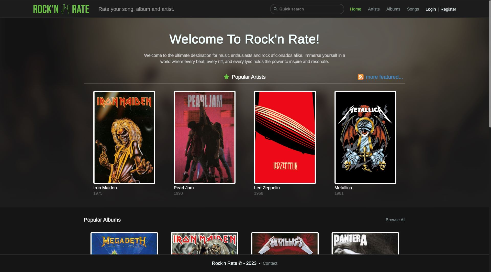
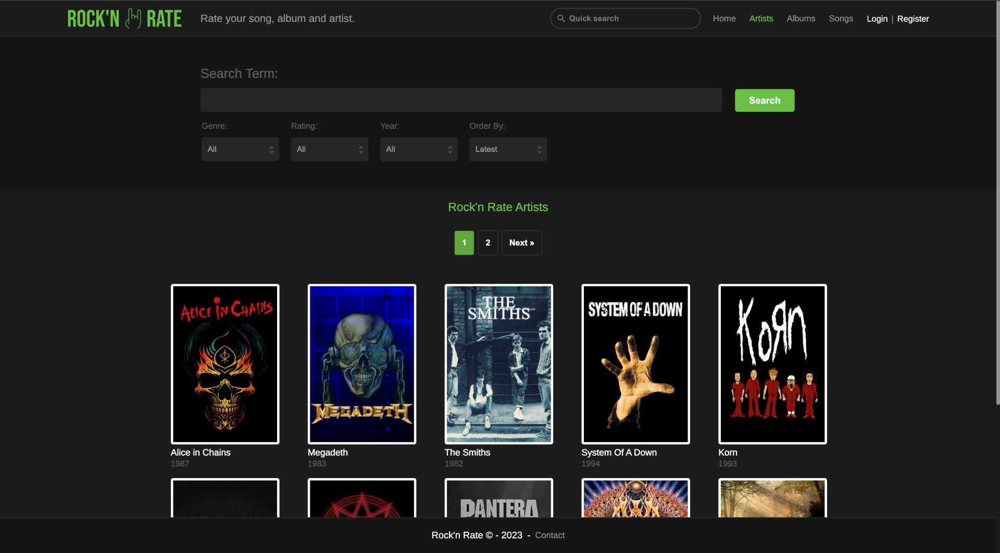
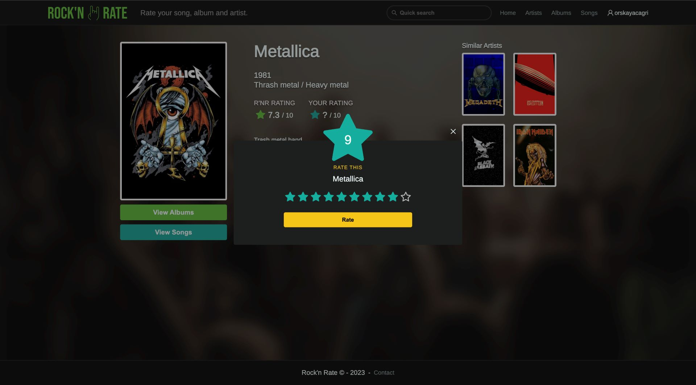

# Rock'n Rate

Rock'n Rate is a sophisticated web application designed for rock music enthusiasts, providing a platform to rate and review artists, albums, and songs. This repository hosts the frontend of the application. The backend of the application can be found [here](https://github.com/corskaya/rock-n-rate-api).

## Live Demo

Experience the live version of the application here: [Rock'n Rate](https://thankful-plant-0cd9f5003.5.azurestaticapps.net/)

## Key Features

- **Comprehensive Search**: Find artists, albums, and songs quickly.
- **Rating and Reviews**: Rate and review on a scale of 1-10.
- **Community Insights**: Explore ratings and reviews from other users.
- **User Contributions**: Add new artists, albums, and songs to the database.
- **User Authentication**: Register, log in, and log out.
- **Responsive Design**: Optimized for desktops, tablets, and mobile phones.

## Technologies Utilized

- **React**
- **TypeScript**
- **Redux Toolkit**
- **React Router**
- **CSS**

## Screenshots

*Homepage showcasing popular artists, albums, and songs.*

*List view of artists with filtering and pagination.*

*Interface for users to rate an artist.*

## License

This project is licensed under the MIT License. For more details, please refer to the `LICENSE` file.
